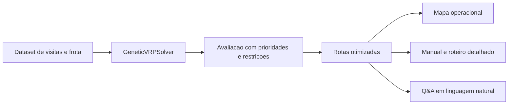

# Otimizacao de Rotas para Atendimento Especializado a Mulher

Este repositorio contem uma implementacao do Tech Challenge, evoluindo o codigo base de TSP para um problema de roteirizacao de veiculos com restricoes reais do contexto de saude da mulher.

O legado do TSP original continua disponivel nos arquivos [genetic_algorithm.py](/mnt/c/desenvolvimento/repositorio/tech-challenge-fase2/genetic_algorithm.py) e [tsp.py](/mnt/c/desenvolvimento/repositorio/tech-challenge-fase2/tsp.py). A nova solucao do projeto esta isolada em [src/womens_health_routing](/mnt/c/desenvolvimento/repositorio/tech-challenge-fase2/src/womens_health_routing).

## O que foi implementado

- Algoritmo genetico para VRP com frota multipla.
- Priorizacao de emergencias obstetricas, violencia domestica, medicacao hormonal, pos-parto e apoio oncologico.
- Restricoes de capacidade, numero maximo de paradas, distancia maxima por veiculo, janela de tempo, protocolo seguro e cadeia fria.
- Visualizacao das rotas em mapa operacional com codificacao por tipo de atendimento.
- Geracao automatica de manual operacional, roteiro detalhado e respostas exemplo em linguagem natural.
- Integracao configuravel com LLM por endpoint HTTP compativel, com fallback local.
- Benchmark comparativo entre algoritmo genetico e baseline guloso viavel.
- Testes automatizados do nucleo do solver.

## Estrutura

- [src/womens_health_routing/domain.py](/mnt/c/desenvolvimento/repositorio/tech-challenge-fase2/src/womens_health_routing/domain.py): entidades do dominio e avaliacao da solucao.
- [src/womens_health_routing/sample_data.py](/mnt/c/desenvolvimento/repositorio/tech-challenge-fase2/src/womens_health_routing/sample_data.py): cenario de demonstracao com visitas, prioridades e frota.
- [src/womens_health_routing/ga_solver.py](/mnt/c/desenvolvimento/repositorio/tech-challenge-fase2/src/womens_health_routing/ga_solver.py): solver genetico de VRP.
- [src/womens_health_routing/reporting.py](/mnt/c/desenvolvimento/repositorio/tech-challenge-fase2/src/womens_health_routing/reporting.py): geracao de instrucoes e relatorios especializados.
- [src/womens_health_routing/baselines.py](/mnt/c/desenvolvimento/repositorio/tech-challenge-fase2/src/womens_health_routing/baselines.py): baseline heuristico para comparacao.
- [src/womens_health_routing/benchmarking.py](/mnt/c/desenvolvimento/repositorio/tech-challenge-fase2/src/womens_health_routing/benchmarking.py): benchmark entre baseline e GA.
- [src/womens_health_routing/visualization.py](/mnt/c/desenvolvimento/repositorio/tech-challenge-fase2/src/womens_health_routing/visualization.py): construcao do mapa operacional.
- [streamlit_app.py](/mnt/c/desenvolvimento/repositorio/tech-challenge-fase2/streamlit_app.py): interface para demonstracao.
- [benchmark_routes.py](/mnt/c/desenvolvimento/repositorio/tech-challenge-fase2/benchmark_routes.py): script de benchmark.
- [tests/test_solver.py](/mnt/c/desenvolvimento/repositorio/tech-challenge-fase2/tests/test_solver.py): testes automatizados.
- [docs/TECHNICAL_DESIGN.md](/mnt/c/desenvolvimento/repositorio/tech-challenge-fase2/docs/TECHNICAL_DESIGN.md): documentacao tecnica.
- [docs/RELATORIO_TECNICO.md](/mnt/c/desenvolvimento/repositorio/tech-challenge-fase2/docs/RELATORIO_TECNICO.md): relatorio tecnico.

## Arquitetura



## Como executar

Crie um ambiente virtual e instale as dependencias:

```bash
python3 -m venv .venv
source .venv/bin/activate
pip install -r requirements.txt
```

Executar o solver em modo terminal:

```bash
python3 run_routes.py
```

Executar a interface Streamlit:

```bash
streamlit run streamlit_app.py
```

Executar benchmark:

```bash
python3 benchmark_routes.py
```

Executar os testes:

```bash
python3 -m unittest discover -s tests -v
```

## Regras de negocio contempladas

- Emergencias obstetricas recebem penalidade maior quando atrasadas.
- Casos de violencia domestica exigem veiculos com protocolo seguro.
- Medicacoes hormonais refrigeradas so podem ser transportadas por veiculos com suporte a cadeia fria.
- Atendimentos pos-parto possuem janela segura de visita.
- Cada veiculo respeita limite de distancia, capacidade de suprimentos e numero de paradas.

## Integracao com LLM

Modo local padrao:

- `ROUTE_LLM_PROVIDER=rule_based`

Modo HTTP compativel com chat completions:

```bash
export ROUTE_LLM_PROVIDER=http
export ROUTE_LLM_ENDPOINT=https://seu-endpoint/v1/chat/completions
export ROUTE_LLM_MODEL=seu-modelo
export ROUTE_LLM_API_KEY=seu-token
```

Se o endpoint nao estiver configurado ou falhar, o sistema usa fallback local deterministicamente.

## Benchmark e analise

O benchmark compara o GA com um baseline guloso viavel para documentar ganho tecnico e apoiar o relatorio tecnico do projeto.


## Validacao realizada

- `python3 -m unittest discover -s tests -v`
- `python3 -m compileall src streamlit_app.py tests`

## Licenca

Este projeto continua licenciado sob a [MIT License](LICENSE).
