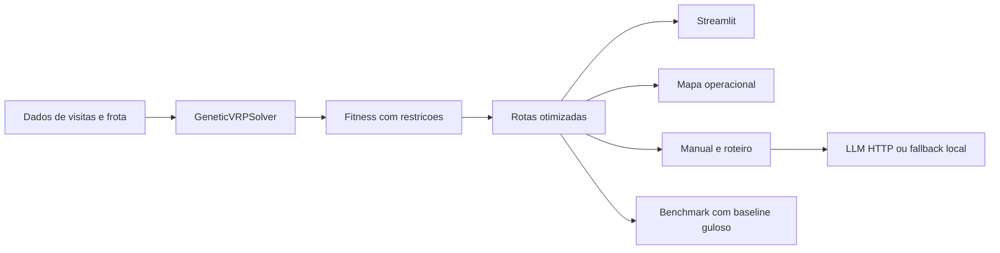

# Relatorio Tecnico

## 1. Resumo Executivo

O presente projeto tem como objetivo o desenvolvimento de uma solucao de roteirizacao especializada para atendimentos e entregas vinculados ao contexto da saude da mulher. O problema foi modelado como uma evolucao do Traveling Salesman Problem para o Vehicle Routing Problem, incorporando restricoes operacionais e clinicas relevantes, tais como prioridade para emergencias obstetricas, sigilo em casos de violencia domestica, cadeia fria para medicamentos hormonais, janelas temporais para atendimentos pos-parto e heterogeneidade da frota.

Sob o ponto de vista tecnico, buscou-se construir uma solucao capaz de gerar rotas viaveis e contextualizadas, fornecer suporte operacional a equipe de transporte por meio de instrucoes especializadas e disponibilizar recursos de visualizacao e analise. A aplicacao foi implementada em Python, com solver baseado em algoritmo genetico, benchmark comparativo com baseline guloso, interface interativa em Streamlit e modulo de narrativa com suporte a integracao configuravel com modelos de linguagem.

## 2. Contexto e Impacto Social

A solucao foi concebida para um contexto em que tempo de resposta, seguranca da paciente e adequacao clinica sao dimensoes mais relevantes do que a mera minimizacao de distancia. Em cenarios associados a saude da mulher, a ordem de atendimento impacta diretamente o risco materno, a continuidade terapeutica e a protecao de pacientes em situacoes de maior vulnerabilidade.

Nesse sentido, o sistema contribui operacionalmente em tres frentes principais:

- prioriza emergencias obstetricas na funcao de fitness, reduzindo o custo de atrasar atendimentos criticos;
- trata violencia domestica como caso sensivel, exigindo protocolo sigiloso e evitando alocacao em veiculos inadequados;
- garante cadeia fria para medicamentos hormonais e respeita janelas seguras para atendimentos domiciliares e hospitalares.

Os beneficios praticos incluem maior organizacao da rota, reducao de visitas inviaveis, aumento da previsibilidade operacional e producao automatizada de documentacao de apoio a execucao em campo.

## 3. Arquitetura da Solucao

Com o intuito de favorecer manutenibilidade, clareza arquitetural e separacao de responsabilidades, o sistema foi estruturado em modulos:

- `domain.py`: entidades do problema, como visita, veiculo, deposito, rota e avaliacao;
- `sample_data.py`: dados de demonstracao e geracao sintetica;
- `ga_solver.py`: algoritmo genetico para alocacao e sequenciamento;
- `baselines.py` e `benchmarking.py`: abordagem gulosa de referencia e comparativo;
- `reporting.py`: geracao de manual operacional, roteiro detalhado e respostas em linguagem natural;
- `visualization.py`: mapa operacional com codificacao por tipo de atendimento;
- `streamlit_app.py`: interface de demonstracao e simulacao.

O fluxo geral da aplicacao pode ser descrito da seguinte forma:

1. o usuario define o cenario e os parametros;
2. o problema e instanciado com visitas, frota e janelas;
3. o solver genetico gera cromossomos, avalia, seleciona, cruza e muta;
4. a melhor solucao e convertida em rotas por veiculo;
5. a interface apresenta mapa, indicadores, conformidade e roteiro;
6. o modulo de narrativa gera texto localmente ou via provider LLM.

O diagrama de referencia a seguir sintetiza a organizacao da solucao:

## 4. Modelagem do Problema

O problema base de TSP foi estendido para VRP a partir da incorporacao dos seguintes elementos:

- mais de um veiculo;
- restricoes de capacidade e de tipo de atendimento;
- janelas de tempo;
- requisitos de sigilo e refrigeracao;
- custo por distancia e penalidades por inviabilidade.

A representacao genetica adota um cromossomo como permutacao de `visit_id`. Tal cromossomo nao representa diretamente a rota final de cada veiculo. Em vez disso, representa a ordem de tentativa de alocacao das visitas, sendo a decodificacao responsavel por distribuir essa sequencia entre os veiculos da frota conforme as restricoes vigentes.

Entidades principais:

- `Visit`: representa paciente ou ponto de atendimento, com servico, janela, local, demanda e requisitos especiais;
- `Vehicle`: representa o recurso logistico, com capacidade, velocidade, custo, tipos permitidos e suportes especiais;
- `Depot`: representa a base operacional;
- `RouteStop` e `Route`: representam a decodificacao operacional da solucao;
- `Evaluation`: agrega fitness, custo, distancia, penalidades e observacoes.

## 5. Algoritmo Genetico

Os operadores geneticos implementados foram os seguintes:

- selecao por torneio;
- crossover do tipo order crossover;
- mutacao por inversao de segmento;
- elitismo para preservacao dos melhores individuos.

Parametros padrao atuais:

- populacao: 80
- geracoes: 120
- taxa de mutacao: 0.22
- tamanho do torneio: 4
- elitismo: 6
- seed: 42

Optou-se por uma configuracao metodologicamente simples e explicavel, favorecendo a interpretabilidade academica dos resultados e a manutencao da base de codigo.

## 6. Restricoes Especificas da Saude da Mulher

As restricoes especificas da saude da mulher incorporadas ao modelo foram:

- ordem de prioridade por tipo de atendimento;
- protocolo sigiloso para casos de violencia domestica;
- cadeia fria para medicamentos hormonais;
- janela segura para atendimentos domiciliares;
- janela especifica para hospitais;
- prazo maximo de transporte para itens urgentes;
- limite de capacidade por suprimentos;
- limite de numero de paradas;
- limite de distancia por veiculo;
- compatibilidade de veiculo por tipo de atendimento;
- frota heterogenea com moto, van refrigerada e carro clinico.

Essas restricoes foram incorporadas tanto na etapa de verificacao de viabilidade quanto na funcao de fitness, por meio de filtros e penalidades.

## 7. Funcao de Fitness

A funcao de fitness foi definida para minimizar simultaneamente:

- distancia total;
- custo total;
- penalidade por visitas nao alocadas;
- penalidade por atraso;
- penalidade ponderada por prioridade clinica.

Formula simplificada:

`fitness = distancia_total + custo_total + penalidades`

Penalidades relevantes:

- visitas nao atendidas: peso muito alto para evitar solucoes incompletas;
- atraso em janela: penalidade temporal;
- atraso em visita prioritaria: penalidade adicional ponderada por prioridade;
- violacoes estruturais: filtro de inviabilidade ou penalidade residual.

Os pesos utilizados foram definidos de maneira empirica, com o objetivo de refletir a criticidade do dominio. Assim, deixar uma visita prioritaria sem atendimento ou com atraso relevante e considerado mais grave do que ampliar moderadamente a distancia percorrida.

## 8. Integracao com LLMs

O projeto contempla dois modos de geracao textual:

- `rule_based`: geracao local deterministica;
- `http`: integracao com endpoint compativel com chat completions.

Tal estrategia permite tanto a demonstracao offline quanto a evolucao futura com modelos reais, sem necessidade de reestruturacao da arquitetura do sistema.

Prompt do manual operacional:

- solicita orientacoes curtas, objetivas e sensiveis ao contexto de saude da mulher;
- enfatiza seguranca, sigilo, prioridade clinica e cadeia fria;
- inclui o contexto completo das rotas otimizadas.

Prompt do roteiro detalhado:

- transforma a rota em instrucoes legiveis;
- inclui ordem de visitas, tipo de atendimento, janela e informacoes relevantes;
- produz um roteiro compreensivel para a equipe em campo.

Perguntas em linguagem natural suportadas no estado atual:

- qual o proximo atendimento prioritario;
- quantas paradas de emergencia temos hoje;
- ha visitas fora da janela.

A avaliacao qualitativa do componente textual pode ser sintetizada da seguinte forma:

- no modo local, o texto e consistente e reproduzivel;
- no modo HTTP, a qualidade passa a depender do modelo configurado e deve ser validada antes de uso real.

## 9. Comparativo com Outras Abordagens

Como forma de avaliacao comparativa, foi implementado um baseline guloso viavel. Essa abordagem seleciona iterativamente a melhor visita localmente viavel conforme prioridade e proximidade, sem o processo evolutivo caracteristico do algoritmo genetico.

Resultados atuais do benchmark:

| Metrica | Baseline guloso | Algoritmo genetico |
|---|---:|---:|
| Fitness | 5279.46 | 248.93 |
| Distancia total (km) | 106.41 | 97.33 |
| Visitas nao alocadas | 1 | 0 |
| Melhoria de fitness | - | 95.28% |

Os resultados indicam que o algoritmo genetico nao apenas reduziu a distancia total percorrida, mas, sobretudo, eliminou a ocorrencia de visita nao alocada, aspecto particularmente relevante em um contexto assistencial sensivel.

## 10. Analise de Impacto

No cenario atualmente utilizado como referencia, o sistema apresentou os seguintes resultados:

- 0 visitas fora da janela;
- 0 visitas nao alocadas;
- primeira emergencia prioritaria prevista para 07:12;
- 2 paradas de emergencia no dia.

Impactos observados:

- menor risco de atraso em casos criticos;
- melhor previsibilidade operacional;
- menos falhas de alocacao;
- maior coerencia entre tipo de atendimento e recurso empregado.

Do ponto de vista da seguranca da paciente, o principal ganho consiste em evitar que o problema seja tratado apenas como um problema de distancia minima. Neste projeto, a ordem de atendimento, o tipo de veiculo e a adequacao clinica sao componentes centrais da solucao.

## 11. Consideracoes Eticas

A aplicacao lida com aspectos sensiveis que demandam tratamento explicito:

- privacidade de localizacao: os dados de visitas podem expor residencia, unidade de saude e deslocamento da equipe;
- sigilo em violencia domestica: detalhes da rota nao devem expor a paciente a risco adicional;
- risco de vies: pesos e regras de prioridade precisam ser transparentes e justificaveis;
- uso de LLM: respostas textuais devem apoiar a equipe, nao substituir protocolo clinico ou decisao medica.

Por essa razao, a arquitetura foi organizada de forma a separar solver, regras de negocio e narrativa. Tal separacao reduz o risco de que a camada generativa interfira diretamente na viabilidade operacional da rota.

## 12. Validacao e Testes

Com relacao a validacao tecnica, foram implementados testes automatizados para:

- cobertura de todas as visitas no cenario de demonstracao;
- alocacao correta de cargas refrigeradas;
- enforcement de restricoes por tipo de veiculo;
- enforcement de janela domiciliar;
- enforcement de janela hospitalar;
- enforcement de prazo maximo de transporte;
- fallback do gerador narrativo sem endpoint LLM;
- benchmark comparativo;
- geracao sintetica com quantidade parametrizavel de pacientes.

Cenarios simulados:

- dataset fixo de demonstracao com 10 visitas;
- cenarios sinteticos parametrizaveis;
- comparativo entre baseline e GA.

Apesar dos resultados obtidos, permanecem alguns limites conhecidos:

- o mapa e cartesiano e nao georreferenciado;
- a calibracao dos pesos da fitness ainda e heuristica;
- a integracao real com LLM depende de endpoint externo configurado;
- nao ha ainda validacao com base de dados clinica real.

## 13. Conclusao

Foi entregue uma solucao funcional de roteirizacao especializada para saude da mulher, fundamentada em algoritmo genetico, restricoes realistas, comparativo com baseline, interface de demonstracao, documentacao tecnica e camada de geracao textual.

Principais resultados:

- transformacao do TSP base em um VRP sensivel ao contexto;
- 0 visitas nao alocadas no cenario principal;
- 0 visitas fora da janela no cenario principal;
- melhoria de 95.28% no fitness em relacao ao baseline guloso.

Como desdobramentos futuros, a solucao pode evoluir em tres direcoes principais:

- integrar dados reais ou semi-reais;
- utilizar mapa georreferenciado;
- aprofundar a integracao com LLM e a governanca de seguranca e privacidade.
