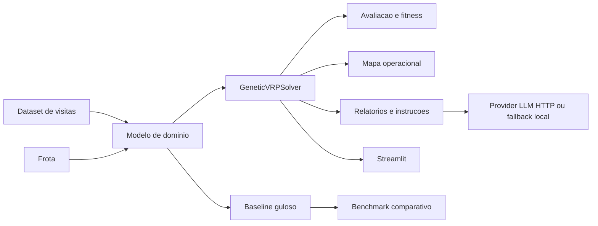

# Documentacao Tecnica

## Objetivo

Resolver um problema de roteirizacao de atendimentos especializados a mulher usando algoritmo genetico, incluindo prioridades clinicas, janelas temporais, cadeia fria, sigilo e frota heterogenea.

## Arquitetura

## Codificacao

- Cromossomo: permutacao dos `visit_id`.
- Decodificacao: leitura sequencial do cromossomo e alocacao progressiva nas rotas dos veiculos, respeitando restricoes de viabilidade.
- Solucao: conjunto de rotas por veiculo mais avaliacao agregada.

## Operadores Geneticos

- Selecao: torneio.
- Crossover: order crossover.
- Mutacao: inversao de segmento.
- Elitismo: preservacao dos melhores individuos a cada geracao.

## Funcao de Fitness

A funcao de fitness minimiza:

- distancia total percorrida;
- custo total da operacao;
- penalidade por visitas nao alocadas;
- penalidade por atraso;
- penalidade adicional ponderada por prioridade clinica.

## Restricoes Implementadas

- Distancia maxima por veiculo.
- Numero maximo de paradas por veiculo.
- Capacidade maxima de suprimentos.
- Compatibilidade de veiculo por tipo de atendimento.
- Janela segura para atendimentos domiciliares.
- Janela de recebimento em hospitais.
- Prazo maximo de transporte para itens urgentes.
- Protocolo seguro para casos sensiveis.
- Cadeia fria para medicamentos hormonais.
- Frota multipla com tipos diferentes de veiculo.

## LLM

O modulo de narrativa suporta dois modos:

- `rule_based`: geracao local deterministica.
- `http`: chamada HTTP para endpoint compativel com chat completions.

Variaveis esperadas:

- `ROUTE_LLM_PROVIDER=http`
- `ROUTE_LLM_ENDPOINT`
- `ROUTE_LLM_MODEL`
- `ROUTE_LLM_API_KEY` opcional

## Benchmark

Foi adicionado um baseline guloso viavel para comparacao contra o algoritmo genetico.

Arquivo:

- `benchmark_routes.py`

## Limites Atuais

- O mapa e cartesiano, nao geografico.
- O provider LLM depende de endpoint externo configurado.
- O dataset atual e demonstrativo, nao clinico real.
